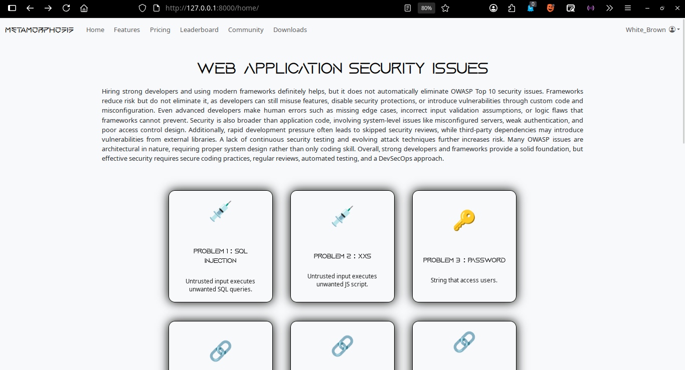

# Metamorphosis — Cybersecurity Training Platform

### Developing Security Awareness Among Web Developers and Users in the Digital Age

Metamorphosis is a cybersecurity training platform designed to improve security awareness among web developers and users through interactive learning and hands-on security demonstrations in a controlled laboratory environment.

The platform combines vulnerable and secured web applications, an Intelligent Learning Assistant, a dedicated browser environment, and a web-based cybersecurity learning portal.

> ⚠️ **Educational Security Project:** The vulnerable components of this project are intentionally insecure and are intended only for controlled, authorized security testing and educational purposes.

---

## 🔐 Security Topics

The cybersecurity laboratory covers the following web application security vulnerabilities:

- SQL Injection
- Broken Access Control
- Identification & Authentication Failures
- Cross-Site Scripting (XSS)
- Cryptographic Failures
- Security Misconfiguration
- Security Logging & Monitoring Failures
- Insecure Design
- Cross-Site Request Forgery (CSRF)
- Server-Side Request Forgery (SSRF)

Each vulnerability is demonstrated through a controlled vulnerable implementation together with corresponding security mitigation techniques.

---

## 🚀 Key Features

- Vulnerable and secured PHP/MySQL banking applications
- Practical cybersecurity demonstrations
- OWASP Top 10–related vulnerability scenarios
- Secure coding and vulnerability mitigation examples
- Python-based Intelligent Learning Assistant
- NLP/ML-based cybersecurity interaction
- Automated browser and form interaction
- Electron.js-based Neo Browser
- Cybersecurity learning modules and quizzes
- Learner progress tracking
- Community and leaderboard features

---

## 🖥️ Main Components

### 1. Cybersecurity Learning Portal

A web-based learning environment containing cybersecurity lessons, quizzes, learning resources, progress tracking, and community features.

---

### 2. Banking Security Laboratory

The laboratory provides vulnerable and secured versions of a banking application with similar functionality. This allows learners to observe how security vulnerabilities occur and how appropriate security controls mitigate them.

#### Insecure Design

Example of an invalid transaction resulting in a negative balance in the vulnerable implementation.

#### SQL Injection

Comparison between the vulnerable and secured implementations using the same SQL injection test input.

#### Cross-Site Scripting (XSS)

Comparison between vulnerable and secured handling of user-controlled input.

---

### 3. Intelligent Learning Assistant

The Intelligent Learning Assistant provides interactive cybersecurity guidance and can assist with practical demonstrations.

It can:

- Understand cybersecurity-related queries
- Explain vulnerabilities and security concepts
- Launch the required applications
- Open and interact with the cybersecurity laboratory
- Automatically enter demonstration inputs
- Guide learners through practical security scenarios
- Provide spoken explanations

---

### 4. Neo Browser

Neo Browser is an Electron.js-based dedicated browser environment designed for interacting with the cybersecurity laboratory and supporting automated demonstrations.

---

## 🛠️ Technologies

**Languages**

- Python
- PHP
- JavaScript
- HTML
- CSS

**Frameworks & Libraries**

- Django
- Bootstrap
- Tailwind CSS
- Electron.js
- scikit-learn
- PyAutoGUI
- gTTS

**Databases**

- MySQL
- SQLite

**Tools & Environment**

- Apache
- XAMPP
- phpMyAdmin

---

## 🔒 Security Mitigations

The secured implementations demonstrate practical defensive techniques including:

- Prepared statements and parameterized queries
- Password hashing
- Authentication and authorization controls
- CSRF protection
- Input validation
- Output encoding
- Rate limiting
- URL validation and allowlisting
- Secure error handling
- Database privilege restrictions
- Security logging and monitoring

---

## ⚠️ Disclaimer

This project is intended **strictly for educational and authorized security testing purposes**.

Some applications and components intentionally contain security vulnerabilities for demonstration and training purposes. They should only be executed in an isolated and controlled environment.

**Do not:**

- Deploy the intentionally vulnerable applications publicly
- Use real passwords, credentials, financial information, or personal data
- Test the vulnerabilities against systems without explicit authorization
- Use the vulnerable components in a production environment

The authors are not responsible for misuse of the intentionally vulnerable components.

---

## 👥 Project Team

**B.Sc. Final Year Design Project**

- **Md. Samiul Islam** — 222311011
- **Omar Faruk Khan** — 222311026
- **Md. Faisal Ahmmed** — 222311036

### Supervisor

**Md. Nour Noby**
Lecturer
Varendra University
Rajshahi

---

## 🎓 Academic Project

**Metamorphosis — Developing Security Awareness Among Web Developers and Users in the Digital Age**

B.Sc. Final Year Design Project

---

## 📌 Project Purpose

The primary goal of Metamorphosis is to bridge the gap between theoretical cybersecurity knowledge and practical understanding by allowing learners to observe vulnerabilities, understand their impact, and explore appropriate security mitigations within a controlled environment.
