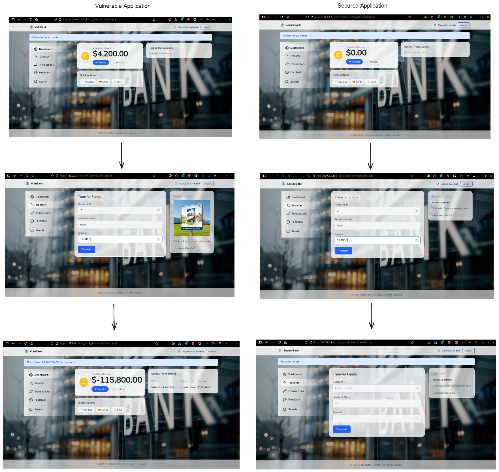
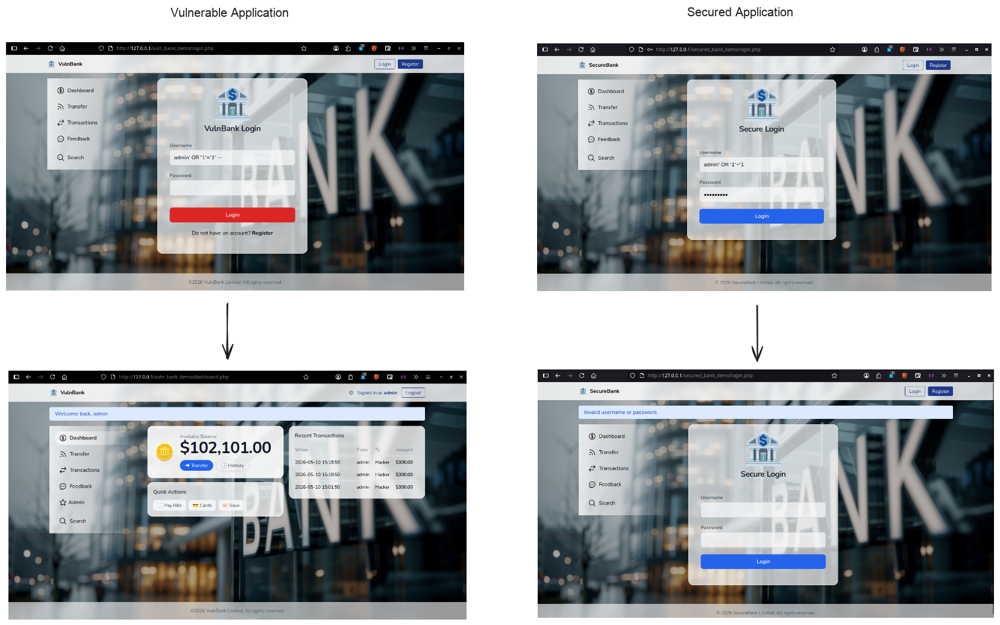
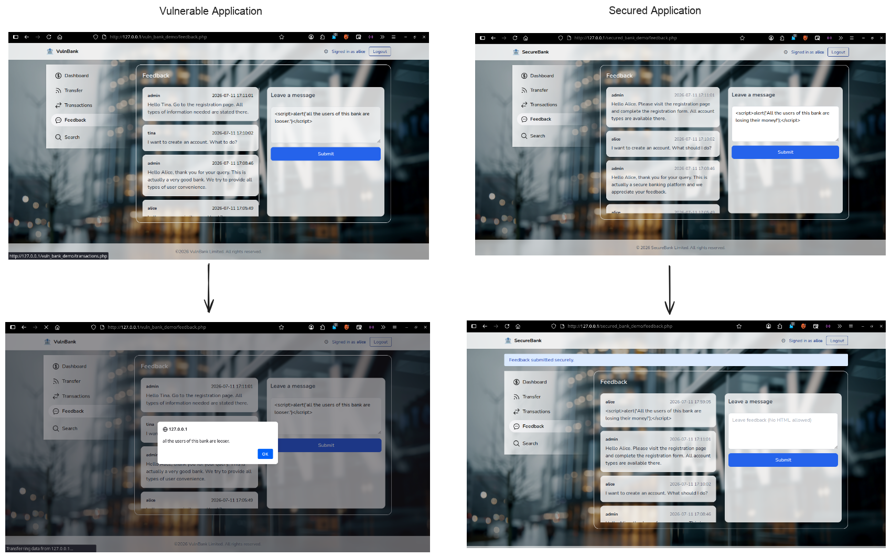
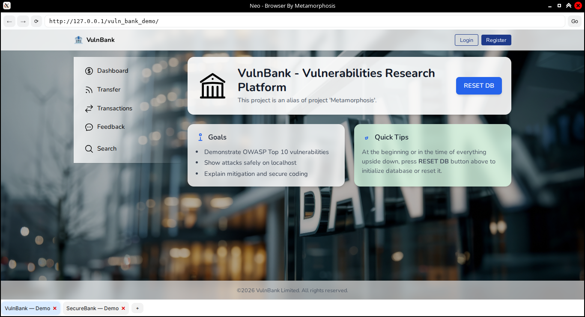

# Metamorphosis — Cybersecurity Training Platform

### Developing Security Awareness Among Web Developers and Users in the Digital Age

Metamorphosis is a cybersecurity training platform designed to improve security awareness among web developers and users through interactive learning and hands-on security demonstrations in a controlled laboratory environment.

The platform combines intentionally vulnerable and secured simulated web applications, an **Intelligent Learning Assistant**, a dedicated browser environment, and a web-based cybersecurity learning portal.

> ⚠️ **Educational Security Project:** This repository contains intentionally vulnerable applications designed exclusively for controlled, isolated, and authorized cybersecurity education and testing. **Do not deploy the vulnerable components publicly or use them against systems without explicit authorization.**

---

## 🔐 Security Topics

The cybersecurity laboratory covers the following web application security vulnerabilities:

* SQL Injection
* Broken Access Control
* Identification & Authentication Failures
* Cross-Site Scripting (XSS)
* Cryptographic Failures
* Security Misconfiguration
* Security Logging & Monitoring Failures
* Insecure Design
* Cross-Site Request Forgery (CSRF)
* Server-Side Request Forgery (SSRF)

Each vulnerability is demonstrated through a controlled vulnerable implementation together with corresponding security mitigation techniques.

---

## 🚀 Key Features

* Vulnerable and secured PHP/MySQL **simulated banking applications**
* Practical cybersecurity demonstrations
* Web application security scenarios inspired by OWASP security guidance
* Secure coding and vulnerability mitigation examples
* Python-based Intelligent Learning Assistant
* NLP/ML-based cybersecurity interaction
* Automated browser and form interaction
* Electron.js-based Neo Browser
* Cybersecurity learning modules and quizzes
* Learner progress tracking
* Community and leaderboard features

---

## 🖥️ Main Components

### 1. Cybersecurity Learning Portal

A web-based learning environment containing:

* Cybersecurity lessons
* Quizzes
* Learning resources
* Progress tracking
* Community features
* Access to the local Banking Security Laboratory

---

### 2. Banking Security Laboratory

> **Note:** The Banking Security Laboratory is a fictional simulation created exclusively for cybersecurity education. It is not affiliated with, connected to, or representative of any real bank, financial institution, payment provider, or banking infrastructure. It does not process real financial transactions or use real customer data.

The laboratory provides vulnerable and secured versions of a simulated banking application with similar functionality. This allows learners to observe how security vulnerabilities occur and how appropriate security controls mitigate them.

#### Insecure Design

Demonstrates how inadequate business-logic validation can result in an invalid transaction, such as a negative account balance.

#### SQL Injection

Compares vulnerable and secured implementations using a controlled SQL injection demonstration.

#### Cross-Site Scripting (XSS)

Compares vulnerable and secured handling of user-controlled input.

**And many more security demonstrations...**

---

### 3. Intelligent Learning Assistant

The Intelligent Learning Assistant provides interactive cybersecurity guidance and assists learners during practical demonstrations.

It can:

* Understand cybersecurity-related queries
* Explain vulnerabilities and security concepts
* Launch required applications
* Open and interact with the cybersecurity laboratory
* Automatically enter predefined demonstration inputs
* Guide learners through practical security scenarios
* Provide spoken explanations

---

### 4. Neo Browser

Neo Browser is an Electron.js-based dedicated browser environment designed for interacting with the cybersecurity laboratory and supporting controlled automated demonstrations.

---

## 🛠️ Technologies

### Languages

* Python
* PHP
* JavaScript
* HTML
* CSS

### Frameworks & Libraries

* Django
* Bootstrap
* Tailwind CSS
* Electron.js
* scikit-learn
* PyAutoGUI
* gTTS

### Databases

* MySQL
* SQLite

### Tools & Environment

* Apache
* XAMPP
* phpMyAdmin

---

## 🔒 Security Mitigations

The secured implementations demonstrate practical defensive techniques including:

* Prepared statements and parameterized queries
* Password hashing
* Authentication and authorization controls
* CSRF protection
* Input validation
* Output encoding
* Rate limiting
* URL validation and allowlisting
* Secure error handling
* Database privilege restrictions
* Security logging and monitoring

---

## ⚠️ Disclaimer

This project is intended **strictly for educational and authorized security testing purposes**.

Some applications and components intentionally contain security vulnerabilities for demonstration and training purposes. They should only be executed in an isolated and controlled environment.

The simulated banking application has **no connection to real banking infrastructure, accounts, transactions, customers, or financial services**.

### Do Not

* Deploy intentionally vulnerable applications publicly.
* Use real passwords, credentials, financial information, or personal data.
* Test the vulnerabilities against systems without explicit authorization.
* Connect the vulnerable laboratory to real banking or payment infrastructure.
* Use the vulnerable components in a production environment.
* Commit API keys, passwords, database credentials, payment credentials, or other secrets to this repository.

The vulnerable components are intentionally included for educational purposes and should not be considered production-ready software.

Users are responsible for ensuring that their use of this project complies with applicable laws, regulations, institutional policies, and authorization requirements.

---

## 🔐 Repository Safety

This repository contains intentionally vulnerable applications for cybersecurity education.

For safe use:

* Run vulnerable applications only in a local or isolated laboratory environment.
* Never expose vulnerable applications directly to the public Internet.
* Use only synthetic accounts, credentials, and financial data.
* Never commit secrets or sensitive configuration files.
* Keep vulnerable and secured implementations clearly separated.
* Test the included vulnerabilities only against the project's own laboratory or systems for which explicit authorization has been obtained.

---

## 👥 Project Team

### B.Sc. Final Year Design Project

* **Md. Samiul Islam** — `222311011`
* **Omar Faruk Khan** — `222311026`
* **Md. Faisal Ahmmed** — `222311036`

### Supervisor

**Md. Nour Noby**
Lecturer \
Varendra University \
Rajshahi, Bangladesh 

---

## 🎓 Academic Project

**Metamorphosis — Developing Security Awareness Among Web Developers and Users in the Digital Age**

**B.Sc. Final Year Design Project**\
**Varendra University, Rajshahi, Bangladesh**

---

## 📌 Project Purpose

The primary goal of Metamorphosis is to bridge the gap between theoretical cybersecurity knowledge and practical understanding.

Learners can observe vulnerabilities, understand their potential impact, and study appropriate security mitigations within a controlled environment.

> **Learn the vulnerability. Understand the impact. Build the defense.**
